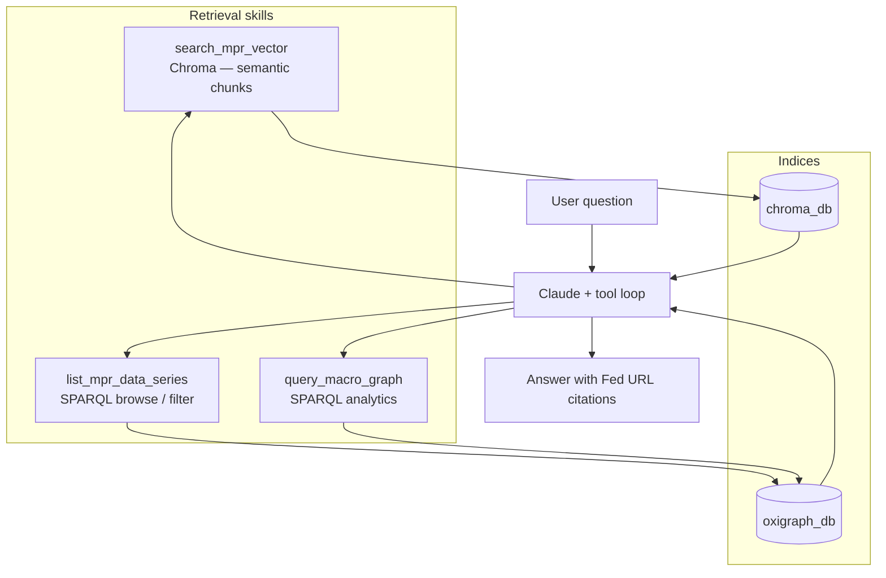

# Fed MPR agentic chat

Streamlit UI + FastAPI backend. Claude calls allowlisted tools: **Chroma** semantic search (`search_mpr_vector`) and **Oxigraph** SPARQL (`query_macro_graph`, `list_mpr_data_series`). Answers should cite Fed URLs from tool output.

This repo is **runtime-only**: there is no ingest pipeline here. You need a populated **`data/chroma_db/`** and **`data/oxigraph_db/`** (and `ANTHROPIC_API_KEY`).

**Architecture and methodology:** [`doc/TECHNICAL.md`](doc/TECHNICAL.md) (Mermaid diagrams, vector vs graph skills, RDF model). The Streamlit app includes a **Technical documentation** tab that renders that file in-app (with diagrams).

---

## What this demonstrates

This project showcases **agentic dual-RAG** over a real policy corpus: **dense retrieval** for narrative and discovery, plus a **knowledge graph** (RDF in Oxigraph) for **exact table cells**, joins, and **provenance** (`eco:statedIn`). The LLM does not query raw databases with free-form SQL; it calls **allowlisted skill scripts** (subprocess) with bounded arguments—reducing risk while keeping queries structured and auditable.



**UI:** one Streamlit app with a sidebar “tab” strip: **Chatbot** (main product), **Knowledge Graph** (paste tool logs → PyVis + local SPARQL), **Technical documentation** (method write-up from `doc/TECHNICAL.md`).

---

## Prerequisites

- [uv](https://docs.astral.sh/uv/getting-started/installation/) and Python 3.10+
- **`data/chroma_db/`** — Chroma collection `mpr_chunks` (see `skills/search_mpr_vector/query_chroma.py`)
- **`data/oxigraph_db/`** — Oxigraph store (see `skills/query_macro_graph/run_sparql.py`, `skills/list_mpr_data_series/list_data_series.py`)
- **`data/target_urls.json`** — which edition is indexed (shown in the agent system prompt)

---

## Credentials

```bash
cp .env.example .env
# set ANTHROPIC_API_KEY
```

| Variable | Required | Notes |
|----------|----------|--------|
| `ANTHROPIC_API_KEY` | Yes | [Anthropic Console](https://console.anthropic.com/) |
| `ANTHROPIC_MODEL` | No | Default `haiku` (or `sonnet`); Streamlit sidebar overrides per request. |
| `MPR_BACKEND_URL` | No | If the API is not `http://127.0.0.1:8000`. |
| `MPR_ASSISTANT_TODAY` | No | ISO date in the system prompt (else server date). |

`.env` is gitignored. Tools only run scripts under `skills/`.

---

## Demo

### I. Intro (1 min)
[](https://youtu.be/yQ0MQ0_8F5Q)

### II. Chatbot Pt.1 (1.5 mins)

- Q. What agent skills do you have?
- Q. Summarize the 2025 monetary policy in terms of holdings of Treasury securities.
  
[](https://youtu.be/mOgJSKOhMcM)

### III. Chatbot Pt.2 (1 min)

- Q. Time series over the past 10 years on the nonfuel import price index.
  
[](https://youtu.be/2IR_BrtJ-z8)

### IV. Chatbot Pt.3 (1.5 mins)

- Q. Unemployment rate future projection and a summary of it in the Monetary Policy Report.
  
[](https://youtu.be/yE1ERCyt6wU)

### V. RDF Knowledge Graph Visualization (1.5 mins)
[](https://youtu.be/AoGtTepW00E)

---

## Run the chat app

```bash
cd agentic_mp_dualrag
uv sync
uv run --env-file .env python -m uvicorn backend.main:app --reload --host 0.0.0.0 --port 8000
uv run --env-file .env streamlit run frontend/app.py
```

- **Streamlit** (default port **8501**): sidebar **Chatbot** | **Knowledge Graph** | **Technical documentation**.  
- **API:** `http://127.0.0.1:8000/docs` (Swagger), `/health` ping.

**Knowledge Graph** (optional second window only): same inspector as the in-app tab.

```bash
uv run streamlit run frontend/graph_tools_viz_standalone.py --server.port 8502
```

---

## Layout

| Path | Role |
|------|------|
| `backend/` | FastAPI + Anthropic loop + SSE |
| `frontend/app.py` | Chat UI + sidebar views (Chatbot, Knowledge Graph, Technical documentation) |
| `frontend/graph_tools_viz.py` | Knowledge Graph panel (imported by `app.py`) |
| `frontend/graph_tools_viz_standalone.py` | Optional standalone Knowledge Graph window |
| `frontend/technical_doc_view.py` | Renders `doc/TECHNICAL.md` with Mermaid (CDN) |
| `skills/` | Subprocess tools (`search_mpr_vector`, `list_mpr_data_series`, `query_macro_graph`) |
| `data/` | `target_urls.json` + generated stores (see `.gitignore`) |
| `doc/TECHNICAL.md` | Architecture, Mermaid diagrams, vector vs graph methodology |

---

## Compliance

Respect [federalreserve.gov](https://www.federalreserve.gov) terms of use, `robots.txt`, and reasonable rate limits.
