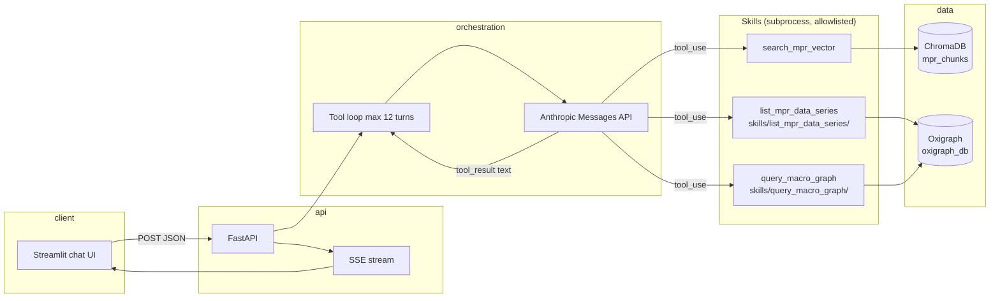
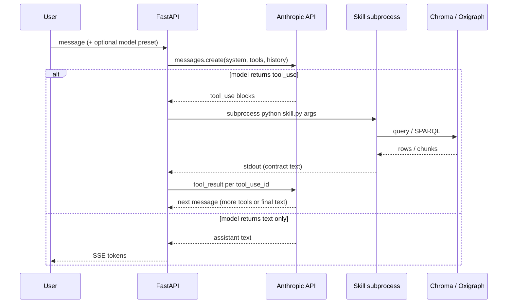
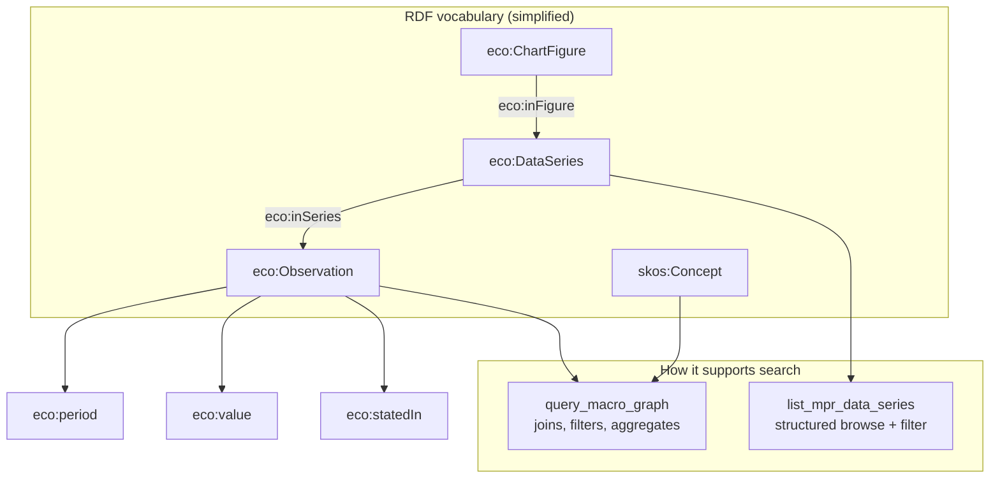

# Technical overview — MPR agentic dual-RAG

This document describes the **architecture**, **retrieval methodologies**, and how the **vector** and **graph** skills support search. It reflects the code in this repository at runtime; **index construction** (how HTML becomes `chroma_db` / `oxigraph_db`) is not shipped here but the **graph model** below matches what the SPARQL skills expect.

---

## 1. High-level architecture

The system is **agentic RAG**: a Claude model decides *when* and *how* to call tools, runs multiple turns, and grounds answers in tool output (especially **live Fed URLs**).

**Components**

| Piece | Role |
|--------|------|
| **Streamlit** (`frontend/app.py`) | Chat UX; consumes **Server-Sent Events** (`status` + `token`) from the API. |
| **FastAPI** (`backend/main.py`) | `POST /chat/stream` returns an SSE stream; CORS enabled for local dev. |
| **Agent loop** (`backend/agent.py`) | Calls `anthropic.messages.create` with **tool definitions**, appends assistant blocks, executes each `tool_use` via **subprocess**, feeds **tool_result** back until the model stops calling tools. |
| **Skills** | Small Python CLIs under `skills/`; only paths registered in `ALLOWED_SCRIPTS` can run (**no arbitrary shell from model text**). |

---

## 2. Agent control loop (methodology)

The orchestration pattern is a **custom explicit loop** (not a black-box agent framework): each API response may contain **text** and/or **tool_use** blocks; tools are executed **synchronously**, stdout becomes the tool result string.

**Techniques**

- **Tool use (function calling)** — Structured JSON arguments validated by the provider; the backend maps tool names to fixed scripts and CLI flags (`--query`, `--top_k`, `--sparql`, `--contains`, `--limit`).
- **Allowlisted subprocess execution** — Reduces blast radius: the model cannot execute arbitrary code, only known entrypoints with bounded arguments (`timeout=120`, `cwd=repo root`).
- **Streaming UX** — Text chunks are yielded to SSE as they are produced; **tool** steps are surfaced as `status` events (tool name + input preview / output preview).

---

## 3. Vector skill — how it works

**Tool:** `search_mpr_vector` → `skills/search_mpr_vector/query_chroma.py`

| Aspect | Implementation |
|--------|----------------|
| **Store** | Chroma **persistent** client on `data/chroma_db/`. |
| **Collection** | `mpr_chunks` (fixed name in code). |
| **Query** | `collection.query(query_texts=[...], n_results=top_k)` — **dense retrieval**: the query string is embedded with the same embedding model Chroma was built with (configured at index build time, not in this repo). |
| **What is retrieved** | Semantically similar **text chunks** from scraped MPR HTML (prose, captions, etc., depending on how the index was built). |
| **Metadata** | Each hit should carry at least `source_url` (Fed page URL) for citations. |
| **stdout contract** | Lines `Text: …` and `Source URL: …` per hit so the model can turn URLs into Markdown links. |

**Methodology name:** **semantic / vector RAG** — good for *vague* questions, themes, “what does the report say about…”, and discovering **which figures or wording** the MPR uses before narrowing to numbers.

---

## 4. Graph skills — how they work

**Tools:** `list_mpr_data_series` → `skills/list_mpr_data_series/list_data_series.py`; `query_macro_graph` → `skills/query_macro_graph/run_sparql.py`

| Aspect | Implementation |
|--------|----------------|
| **Store** | **Oxigraph** `Store.read_only("data/oxigraph_db")` — on-disk RDF database (RocksDB-style persistence). |
| **Query language** | **SPARQL 1.1** (`SELECT`, `ASK`, `CONSTRUCT`, etc.). |
| **Discovery helper** | `list_mpr_data_series` runs a fixed **SELECT DISTINCT** pattern over `eco:DataSeries` joined to `eco:ChartFigure` labels, optional `FILTER(CONTAINS(LCASE(...)))`, capped `LIMIT`. Prints a **TSV header** + rows: `series_iri`, `series_label`, `figure_label`. |
| **Ad hoc analytics** | `query_macro_graph` runs **arbitrary SPARQL** supplied by the model; results are serialized as **TSV** (SELECT), `true`/`false` (ASK), or triple lines (CONSTRUCT). |

**Methodology name:** **symbolic / knowledge-graph RAG** — good for **exact** table cells: period × series × numeric value, with **provenance** (`eco:statedIn` → source page IRI).

**Orchestration rule (system prompt):** use **vector search first** for broad questions; use **list → SPARQL** when the user needs **precise numbers** from chart tables. The graph is **not** a fuzzy search engine; the model must write structured queries against known predicates.

---

## 5. What the graph is built upon (data model)

This repository **consumes** the graph; it does **not** define the ingest pipeline. Conceptually, the store is **RDF** using a small **application vocabulary** in the `eco:` namespace (`https://example.org/macro#`) plus standard **SKOS** for abbreviations and **RDFS**/`dct:` where applicable. See `skills/query_macro_graph/ontology_ref.md` for the full predicate list.

**Typical content (as consumed by tools)**

- **Chart tables** (often from Fed **accessible** HTML table views): modeled as **`eco:ChartFigure`** → **`eco:DataSeries`** → **`eco:Observation`** with `eco:period` (row label), `eco:value`, `eco:statedIn` (page URL). Non-numeric placeholders (e.g. “–”) are usually **omitted** as observations so SPARQL sees mostly typed numerics.
- **Abbreviations:** **`skos:Concept`** with notation / labels for entity-style lookup.
- **Optional prose in RDF:** Some builds also materialize **`eco:ProseDocument`** / **`eco:ContentBlock`** (mirroring narrative structure). Whether those triples exist depends on how **`oxigraph_db`** was produced.

**How the graph supports search (vs vector)**

| Need | Vector (Chroma) | Graph (Oxigraph) |
|------|------------------|------------------|
| Similar meaning / paraphrase | Strong | Weak |
| Exact cell value, specific period | Weak | Strong |
| Provenance URL for a number | Via chunk metadata | Via `eco:statedIn` on observations |
| Joins across series / figures | N/A | Native SPARQL |

The two indices are **not merged** at retrieval time: the **LLM** combines evidence from both **tool transcripts** in the conversation.

---

## 6. Corpus metadata in the system prompt

`backend/agent.py` reads **`data/target_urls.json`** to inject **which MPR edition** is indexed (vector + graph), plus optional **`MPR_ASSISTANT_TODAY`** for calendar grounding. That keeps answers aligned with **report vintage** rather than implying real-time macro data.

---

## 7. File map (runtime)

| Path | Purpose |
|------|---------|
| `backend/agent.py` | Model resolution, tool defs, subprocess runner, system prompt, loop. |
| `backend/main.py` | FastAPI app, SSE framing. |
| `frontend/app.py` | Streamlit client for `/chat/stream`. |
| `skills/search_mpr_vector/query_chroma.py` | Chroma query CLI. |
| `skills/query_macro_graph/run_sparql.py` | SPARQL CLI. |
| `skills/query_macro_graph/SKILL.md` | SPARQL examples and graph-tool orchestration. |
| `skills/list_mpr_data_series/list_data_series.py` | Series discovery (fixed SPARQL). |
| `skills/list_mpr_data_series/SKILL.md` | Discovery tool notes for authors. |

---

## 8. References (standards)

- **RDF / SPARQL** — W3C RDF 1.1 and SPARQL 1.1 query algebra (implemented by Oxigraph).
- **SKOS** — Simple Knowledge Organization System for controlled labels / notations.
- **Anthropic tool use** — [Messages API](https://docs.anthropic.com/en/api/messages) with `tools` and `tool_result` content blocks.
